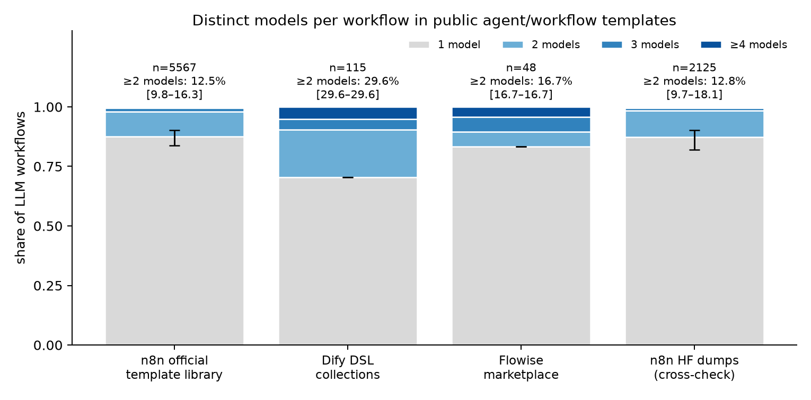
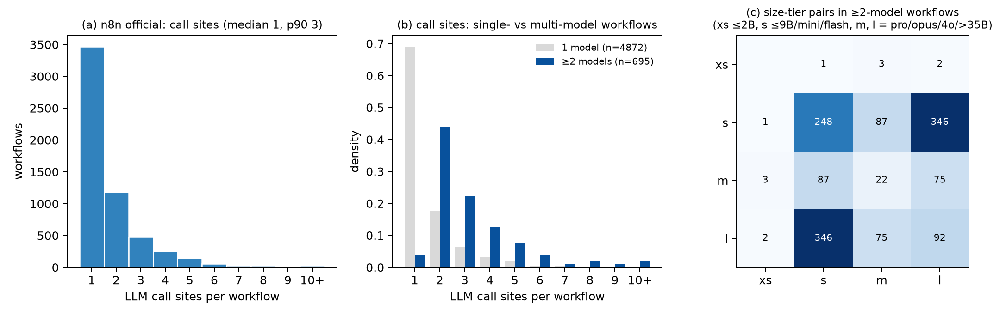

# How often does one agent workflow use more than one model?

*Measured on public workflow-template corpora, fetched 2026-08-30. Every number below is in `data/parsed/summary.json`; regenerate with `scripts/run_all.sh`.*

## TL;DR

- In the **n8n official template library** (the largest public corpus of deployable agent workflows; 5759 AI-category templates after de-duplication, 5673 of which invoke an LLM), **12.5% of LLM workflows invoke ≥2 distinct models** (bounds 9.8%–16.3% depending on how unresolvable model fields are counted). 38.9% have ≥2 LLM call sites; among those, **30.8%** use ≥2 models.
- The same measurement on **Dify** community/official DSL gives **29.6%**, on the **Flowise** marketplace **16.7%**, and on the HF n8n dumps 12.8% (cross-check, all categories).
- What the mixes are: overwhelmingly a **small model paired with a large one** (size-tier pairs among multi-model n8n workflows: l-s: 346, s-s: 248, l-l: 92, m-s: 87, l-m: 75, m-m: 22, m-xs: 3, l-xs: 2, s-xs: 1); the most common pairs are gpt-4o + gpt-4o-mini; gpt-4.1-mini + gpt-4o-mini; gpt-4.1 + gpt-4.1-mini. Multi-model workflows have a median of 3 call sites vs 1 for single-model ones.
- Mixing across **vendors** is less common (5.6% of n8n LLM workflows); mixing **≥2 open-weight models** is rare today (0.5% n8n, 13.9% Dify) because templates default to hosted closed APIs; 1.6% of n8n and 29.6% of Dify LLM workflows use a self-host provider (Ollama / OpenAI-compatible endpoint).
- Explicit model routers exist as a first-class construct: n8n's `Model Selector` node appears in 6 templates; Dify's `question-classifier` and Flowise's condition-agent play the same role.

## 1. Question and scoping

The serving-side question is whether a single agent *request* fans out over several models, so that a platform hosting the models must decide **which model to load next** for in-flight requests. We count, per workflow template, the number of **distinct model identifiers** among its LLM call sites (any vendor). Secondary columns split that by vendor, size tier, open-weight availability and self-host provider:

- the multi-model rate **regardless of provider** is the design-practice number (how often authors compose models);
- the **≥2 open-weight** and **self-host** columns are the population where the load-sequence problem is realised *today*;
- the **≥2 size tiers** column is the addressable population: a small+large pair on closed APIs (gpt-4o-mini + gpt-4.1, gemini-flash + gemini-pro) becomes a self-hosted two-model chain the moment the closed models are swapped for open equivalents of the same tiers — which is exactly what a platform serving open models offers.

## 2. Method

**Corpora.** Templates, not deployments (see limitations):

| corpus | what | size |
|---|---|---|
| n8n official template library | `api.n8n.io/api/templates/search?category=AI` index (8,185 templates) → full workflow JSON for the 5941 that contain a LangChain node | primary |
| Dify DSL collections | official `tmpl.dify.ai` feed (28) + GitHub `svcvit/Awesome-Dify-Workflow` (46), `wwwzhouhui/dify-for-dsl` (92), `difyhub/workflows` (11), `Winson-030/dify-DSL` (3) | 180 raw / 136 de-duplicated |
| Flowise marketplace | `FlowiseAI/Flowise` `packages/server/marketplaces/{chatflows,agentflows,agentflowsv2}` | 51 |
| Langflow starter projects | `langflow-ai/langflow` `initial_setup/starter_projects` | 27 (site counts only: exported templates carry no model ids) |
| n8n HF dumps | `mbakgun/n8nbuilder-n8n-workflows-dataset`, `ruh-ai/n8n-workflow-dataset`, `npv2k1/n8n-workflow` | 9152 raw / 5127 de-duplicated; all categories; cross-check only |

**Call sites.** A call site is a node that invokes a model at runtime (n8n: `agent`, `chainLlm`, `informationExtractor`, `textClassifier`, vendor nodes such as `openAi`; Dify: `llm`, `agent`, `question-classifier`, `parameter-extractor`; Flowise: chains/agents fed by a chat-model node, or v2 agent/LLM nodes; Langflow: `Agent`/`LanguageModelComponent`). Embedding, reranker and image/audio nodes are recorded but excluded from the headline. In n8n the model is read from the LM sub-node wired in through an `ai_languageModel` connection (following `modelSelector` routers); model fields come as strings, resource-locator objects, `=`-prefixed literals, or `models/…` Gemini ids.

**Model resolution.** Each site is `explicit` (a literal model id), `default` (field omitted → node default, which for several n8n nodes changed over time without a version bump — see `data/node_defaults.csv`), `expression` (set at runtime) or `unknown` (no model wired). Ids are normalised by a regex table (`scripts/normalise_models.py`) to vendor / family / size / tier / open-weight; unmatched ids stay distinct raw strings (`data/parsed/unmatched_models.json`).

**Metrics.** Per workflow: `n_sites`, `n_models` (distinct explicit ids; a default site counts as the same model as an explicit id of the same provider if one exists, else as one `<provider>:default` model), with bounds `lb` (explicit ids only) and `ub` (every default/unknown site distinct). Denominator for the multi-model rate: LLM workflows with ≥1 attributable site. `n_tiers` uses xs ≤2B, s ≤9B or nano/mini/flash/haiku, m, l = pro/opus/sonnet/gpt-4o/gpt-4.1/>35B.

**De-duplication.** Structural hash over the multiset of node types/versions and typed edges (names, positions, ids and sticky notes dropped); one workflow kept per hash and corpus (highest view count first). Dify collections had 44 duplicates (cn/en copies, cross-repo re-posts).

## 3. Results

| corpus | templates raw / dedup | LLM workflows | ≥2 call sites | **≥2 models** [lb–ub] | ≥2 models given ≥2 sites | ≥2 vendors | ≥2 size tiers | any open-weight | ≥2 open-weight | any self-host provider | sites median / p90 | default / unknown site rate |
|---|---|---|---|---|---|---|---|---|---|---|---|---|
| n8n official template library (AI category) | 5941 / 5759 | 5673 | 38.9% | **12.5%** [9.8%–16.3%] | 30.8% | 5.6% | 6.2% | 6.6% | 0.5% | 1.6% | 1 / 3 | 27.0% / 2.3% |
| Dify DSL collections | 180 / 136 | 115 | 53.0% | **29.6%** [29.6%–29.6%] | 55.7% | 23.5% | 21.7% | 60.0% | 13.9% | 29.6% | 2 / 5 | 0.0% / 0.0% |
| Flowise marketplace | 51 / 50 | 48 | 22.9% | **16.7%** [16.7%–16.7%] | 72.7% | 16.7% | 10.4% | 10.4% | 0.0% | 4.2% | 1 / 4 | 0.0% / 0.0% |
| n8n HF dumps (cross-check) | 9152 / 5127 | 2157 | 40.2% | **12.8%** [9.7%–18.1%] | 30.8% | 5.4% | 6.2% | 6.3% | 0.4% | 3.9% | 1 / 3 | 30.8% / 2.3% |
| Langflow starter projects | 27 / 25 | 24 | 33.3% | n/a (no model ids in exports) | | | | | | | 1 / 3 | |

Distribution of distinct models per attributable n8n LLM workflow: 1: 4872, 2: 581, 3: 83, ≥4: 31.

**What is mixed (n8n official, 695 multi-model workflows).** Size-tier pairs: l-s: 346, s-s: 248, l-l: 92, m-s: 87, l-m: 75, m-m: 22, m-xs: 3, l-xs: 2, s-xs: 1. Top model pairs:

| pair | workflows |
|---|---|
| gpt-4o + gpt-4o-mini | 58 |
| gpt-4.1-mini + gpt-4o-mini | 42 |
| gpt-4.1 + gpt-4.1-mini | 29 |
| gpt-4.1-mini + gpt-4o | 28 |
| google:default + openai:default | 25 |
| openai:default + openrouter:default | 18 |
| anthropic:default + openai:default | 15 |
| google:default + gpt-4.1-mini | 13 |
| gpt-4.1 + gpt-4o | 10 |
| chatgpt-4o-latest + gpt-4o-mini | 10 |
| gpt-4o-mini + gpt-5-mini | 10 |
| chatgpt-4o-latest + gpt-4.1-mini | 9 |
| google:default + gpt-4o-mini | 8 |
| gpt-5 + gpt-5-mini | 8 |
| google:default + gpt-5-mini | 8 |

Top models over all explicit n8n generation sites:

| model | sites |
|---|---|
| gpt-4o-mini | 1449 |
| gpt-4.1-mini | 1066 |
| gpt-4o | 826 |
| gpt-4.1 | 243 |
| gpt-5-mini | 226 |
| gemini-2.5-flash | 200 |
| claude-sonnet-4-5-20250929 | 168 |
| chatgpt-4o-latest | 138 |
| claude-sonnet-4-20250514 | 128 |
| gemini-2.0-flash-exp | 128 |
| gemini-2.0-flash | 125 |
| gemini-2.5-pro | 119 |
| gemini-3.1-flash-lite | 115 |
| gpt-5 | 113 |
| llama-3.3-70b-versatile | 111 |

Top open-weight models (n8n): llama-3.3-70b-versatile (111), llama3.1 (99), gpt-oss-120b (73), gpt-oss-20b (36), deepseek-v4-flash (31), llama3.2-16000 (17), deepseek-chat-v3-0324 (17), llama-3.1-8b-instant (13). Distinct open-weight models declared on self-host providers: 34.

**Named examples (n8n official, by views):**

| id | template | sites | models | model set | views |
|---|---|---|---|---|---|
| [5338](https://n8n.io/workflows/5338) | Generate AI viral videos with Seedance and upload to TikTok, YouTube & Instagram | 2 | 2 | gpt-4.1, gpt-5-mini | 214907 |
| [3066](https://n8n.io/workflows/3066) | ✨🤖Automate Multi-Platform Social Media Content Creation with AI | 4 | 2 | gpt-4o, gpt-4o-mini | 205470 |
| [3442](https://n8n.io/workflows/3442) | Fully automated AI video generation & multi-platform publishing | 4 | 3 | gpt-4o, gpt-4o-mini, o3-mini | 191045 |
| [3121](https://n8n.io/workflows/3121) | AI-powered short-form video generator with OpenAI, Flux, Kling, and ElevenLabs | 3 | 2 | gpt-4o-mini, o3-mini | 92907 |
| [2982](https://n8n.io/workflows/2982) | 🤖 AI powered RAG chatbot for your docs + Google Drive + Gemini + Qdrant | 3 | 2 | gemini-2.0-flash-exp, openai:default | 65428 |
| [3135](https://n8n.io/workflows/3135) | ✨🩷Automated social media content publishing factory + system prompt composition | 4 | 2 | gpt-4o, gpt-4o-mini | 55060 |
| [2271](https://n8n.io/workflows/2271) | Gmail AI Auto-Responder: Create Draft Replies to incoming emails | 2 | 2 | gpt-4-turbo, gpt-4o | 54727 |
| [2878](https://n8n.io/workflows/2878) | Host your own AI deep research agent with n8n, Apify and OpenAI o3 | 6 | 2 | gemini-2.0-flash, o3-mini | 47644 |
| [2431](https://n8n.io/workflows/2431) | Ultimate scraper workflow for n8n | 5 | 2 | gpt-4o, gpt-4o-mini | 42963 |
| [3085](https://n8n.io/workflows/3085) | Automate SEO-Optimized WordPress posts with AI & Google Sheets | 3 | 2 | deepseek-chat, gemini-2.0-flash-exp | 36976 |
| [2777](https://n8n.io/workflows/2777) | 🐋DeepSeek V3 chat & R1 reasoning quick start | 2 | 2 | deepseek-r1:14b, deepseek-reasoner | 36793 |
| [2783](https://n8n.io/workflows/2783) | AI marketing report (Google Analytics & Ads, Meta Ads), sent via email/Telegram | 5 | 2 | gpt-4o, gpt-4o-mini | 36102 |

Other fixed points used to validate the parsers: Flowise "Supervisor Worker" (agentflow v2) = 4 sites / 3 models (gpt-4o-mini supervisor-workers, gemini-2.5-flash, gpt-4.1); Dify "Deep Researcher" = 19 LLM nodes / 2 models (gemini-2.0-flash-exp + deepseek-r1-distill-llama-8b); n8n 9247 "Smart chat routing between Gemini and GPT models" = `Model Selector` fanning gpt-4.1-nano / gemini-2.5-pro / gemini-2.0-flash into one agent.

## 4. The other population: single-model, multi-call workflows

38.9% of n8n LLM workflows have ≥2 call sites and the p90 is 3 sites (Dify: median 2, p90 5; Dify "Deep Researcher" alone has 19). Even when all sites share one model, the chain length is what a load scheduler's lookahead is worth: a request whose remaining chain calls the same model again (p90: 3 sites in total) is a reason to keep that model resident. So the single-model majority is not irrelevant to load scheduling — only the *cross-model* reordering benefit is limited to the multi-model share.

## 5. Limitations

- **Templates ≠ deployments.** Counts reflect what authors publish, not traffic. Two biases in opposite directions: showcase templates over-represent multi-vendor demos; vendor marketplaces (Flowise, Langflow, n8n's own examples) and free-tier defaults over-represent a single OpenAI model.
- **Defaults.** 27.0% of n8n LLM workflows have at least one site whose model is the node default; the default for the Gemini and OpenAI chat-model nodes changed over time without a version bump, so those sites cannot be named exactly. The lb/ub bounds bracket the effect; the headline assumes a default site equals an explicit model of the same provider when one exists.
- **Open-weight share is a floor.** Templates are written against hosted APIs because that is what template authors have; the size-tier split (§1) is the better proxy for what a self-hosting platform would see.
- **Langflow** exports strip model choices entirely; only site counts are reported.
- **Parser verification.** 55 workflows labelled by hand from the raw files; agreement with the parser on call-site count 100.0%, on distinct-model count 100.0%, on the ≥2-models decision 100.0%. The first labelling pass found three parser rules wrong (vision calls through the OpenAI vendor node counted as image generation; unconnected model sub-nodes counted as invoked; one site counted per attached model rather than per consumer when two models feed one agent as a fallback) — all fixed before the final run; the numbers above come from the corrected parsers.

## 6. Reproduction

`bash scripts/run_all.sh` (fetch → parse → normalise → metrics → figures → report). Raw n8n detail crawl and HF dumps are gitignored and re-fetched by the scripts; everything else is committed. HF-dump overlap with the API crawl (structural hash): 1542 of 5127 (30.1%) — the HF dumps span all template categories, the crawl only the AI category. Parse failures: {'n8n_api_failures': 0, 'dify_failures': 0, 'langflow_failures': 0, 'n8n_hf_failures': 0, 'flowise_failures': 0}.
